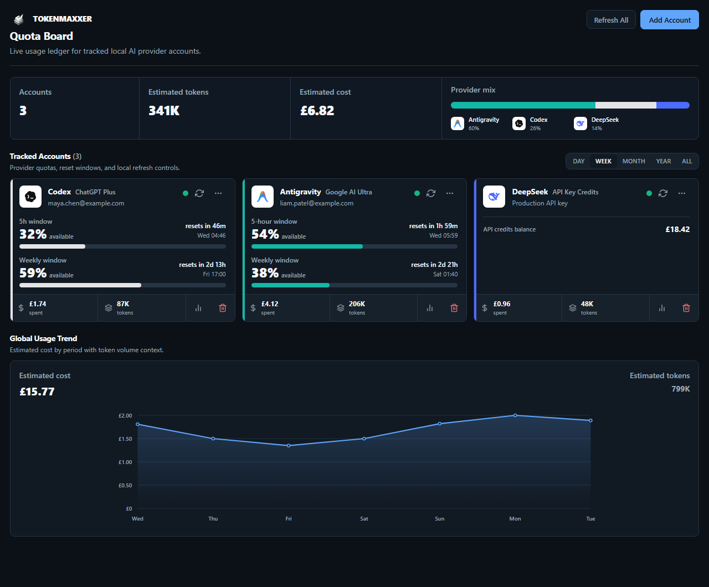

# TokenMaxxer

TokenMaxxer is a local-first desktop app for tracking LLM subscription and API
usage across multiple accounts and providers. It shows current usage, reset
times, provider-reported balances, token totals, estimated spend, refresh
health, and local usage history in one board.

This repository is preparing a public open-source preview release. The preview
is intentionally `v0.1.0`: useful for developers and early users, but not a
paid, signed, notarized, or app-store-style commercial release.



## What It Tracks

| Provider | What you see | How it is read |
| --- | --- | --- |
| Codex / ChatGPT | 5-hour and weekly usage windows with reset countdowns | Read-only access-token lookup from an isolated Codex profile |
| Gemini / Antigravity OAuth | Per-model quota with reset details | Direct Antigravity connector path; one account per connector export |
| DeepSeek | Account balance and estimated usage | DeepSeek API credentials |
| Z.ai | Quota-style usage where available | Z.ai API credentials |
| OpenRouter | Remaining credits and all-time key/account spend | OpenRouter `/credits` and `/key` APIs |
| OpenAI API | Organization usage tokens and costs | OpenAI Admin API usage/cost endpoints |
| Anthropic API | Organization message usage tokens and costs | Anthropic Admin API usage/cost reports |
| Claude Code | Team Claude Code usage tokens and estimated cost | Anthropic Claude Code usage report |
| Cursor Teams | Team usage-event tokens and billed cents | Cursor Teams Admin API |
| Contextual AI | Tenant balance and monthly billing usage | Contextual AI billing endpoints |
| xAI / Grok | Team prepaid balance and best-effort usage totals | xAI Management API billing endpoints |
| Amazon Bedrock | Input/output/cache token totals and throttles | CloudWatch `AWS/Bedrock` metrics via signed `GetMetricData` |
| Azure OpenAI / AI Foundry | Prompt/generated token totals | Azure Monitor metrics for the resource id |
| Fireworks AI | Prompt/completion token totals | Fireworks `firectl billing export-metrics` CSV |

TokenMaxxer does not synthesize provider usage for services that lack a
reliable official or directly verified usage, quota, or balance API. Gemini
API-key-only, Mistral, Together, and personal/editor-only tools without billing
endpoints remain documented backlog candidates until their public API surfaces
expose enough data for a truthful snapshot.

## Privacy Model

TokenMaxxer has no hosted account, telemetry service, analytics pipeline, or
cloud dashboard. It contacts provider APIs directly from your desktop.

| Data | Where it lives |
| --- | --- |
| Provider credentials | OS secure storage where available: Windows DPAPI, macOS Keychain, or Linux Secret Service |
| Codex profiles | An isolated local `CODEX_HOME` profile per Codex account, because the Codex CLI owns its login cache |
| Account labels and provider config | Local `config.json` under the per-user app data directory |
| Usage history | Local `history.json` under the per-user app data directory |

Treat every Codex `auth.json`, API key, OAuth token, cloud credential, or
exported billing file as a secret. TokenMaxxer does not copy Codex refresh
tokens into its own vault, but the isolated Codex profile is still sensitive.

## Known Limitations

- Preview builds are unsigned community builds. Windows SmartScreen reputation
  prompts and macOS Gatekeeper warnings are expected until a future signed
  release has enough reputation.
- The `v0.1.0` preview is not Apple-notarized and is not registered through an
  app store. macOS users may need to approve the app manually in System
  Settings after opening the DMG.
- In-app automatic updates are preserved for future signed updater releases,
  but unsigned preview builds should be updated manually from GitHub Releases.
  Do not publish a `latest.json` updater manifest for unsigned artifacts.
- Guided Codex sign-in is currently Windows-only. Codex tracking itself uses
  isolated local profiles, and macOS/Linux guided setup needs a future launcher
  path before it is pleasant.
- Several providers rely on live billing, admin, quota, or direct-behavior API
  surfaces that can change without notice. TokenMaxxer reports fetch failures
  instead of inventing missing data.
- Gemini API-key-only, Mistral, Together, and other services without a verified
  usage/balance endpoint are deferred rather than approximated.

## Install A Preview Build

When a GitHub preview release exists, download the asset for your platform from
the latest release:

- Windows: `TokenMaxxer-Windows-x64-setup.exe`
- macOS: `TokenMaxxer-macOS-universal.dmg`
- Linux: `TokenMaxxer-Linux-x86_64.AppImage` or
  `TokenMaxxer-Linux-x86_64.deb`

These preview artifacts are expected to be unsigned. That means the operating
system may ask you to confirm that you trust the downloaded app. If the direct
download links on the marketing page return 404, open the
[GitHub Releases page](https://github.com/joshuasknott/tokenmaxxer/releases)
and choose the latest preview manually.

## Prerequisites For Local Development

1. Rust toolchain
2. Node.js and pnpm
3. Platform desktop dependencies:
   - Windows: Visual Studio C++ Build Tools and WebView2 Runtime
   - macOS: Xcode Command Line Tools
   - Linux: Tauri WebKit/GTK dependencies and a Secret Service provider such as
     GNOME Keyring or KWallet

## Run Locally

```bash
pnpm install
pnpm tauri dev
```

Build the web frontend:

```bash
pnpm build
```

Build a local desktop bundle on the current operating system:

```bash
pnpm tauri build
```

## Release Packaging

Tauri packaging must be produced on the target operating system. For unsigned
community preview installers, use the `package:*` scripts. They disable platform
code signing and updater artifacts so contributors can test or publish preview
packages without release credentials.

| Platform | Command | Artifacts |
| --- | --- | --- |
| Windows | `pnpm package:windows` | `src-tauri/target/release/bundle/nsis/*.exe` |
| macOS | `pnpm package:macos` | `src-tauri/target/universal-apple-darwin/release/bundle/dmg/*.dmg` and `src-tauri/target/universal-apple-darwin/release/bundle/macos/*.app` |
| Linux | `pnpm package:linux` | `src-tauri/target/release/bundle/appimage/*.AppImage`, `src-tauri/target/release/bundle/deb/*.deb` |

The `Release packages` GitHub Actions workflow has three modes:

- `workflow_dispatch`: unsigned dry packaging for all platforms.
- `v0.*` tag push: unsigned public preview release assets. This path does not
  generate or attach `latest.json` because Tauri updater artifacts must be
  signed.
- other `v*` tag push: strict signed production packaging using `release:*`.

Future signed release scripts remain available for maintainers with signing
material configured:

| Platform | Command | Signing behavior |
| --- | --- | --- |
| Windows | `pnpm release:windows` | Supports Authenticode signing through a certificate thumbprint or CI-injected config |
| macOS | `pnpm release:macos` | Uses Developer ID signing and Apple notarization credentials when exported |
| Linux | `pnpm release:linux` | Produces AppImage and `.deb` bundles with Tauri updater signatures |

The platform-specific Tauri config files are:

- `src-tauri/tauri.windows.conf.json` for the NSIS Windows installer
- `src-tauri/tauri.macos.conf.json` for `.app`, `.dmg`, hardened runtime, and
  Developer ID signing readiness
- `src-tauri/tauri.linux.conf.json` for AppImage and `.deb` bundles
- `src-tauri/tauri.dev.conf.json` for unsigned local package builds

For the full checklist, including local preflight commands, preview publishing
steps, future signing secrets, and expected assets, see
[`docs/RELEASE_CHECKLIST.md`](docs/RELEASE_CHECKLIST.md).

## Update Channel

The app includes the official Tauri v2 updater plugin, but Tauri updater
artifacts must be signed. For the `v0.1.0` public preview, prefer manual GitHub
downloads and do not attach a `latest.json` updater manifest to the release.

The committed `src-tauri/tauri.conf.json` contains only the public updater key.
The matching private key must stay outside the repository and be stored as
GitHub Actions secrets before publishing a signed updater release.

When a future signed release is ready, the updater manifest is expected at:

```text
https://github.com/joshuasknott/tokenmaxxer/releases/latest/download/latest.json
```

Production tag builds require these GitHub Actions secrets:

- Updater: `TAURI_SIGNING_PRIVATE_KEY`, and
  `TAURI_SIGNING_PRIVATE_KEY_PASSWORD` when the updater key has a password
- Windows Authenticode: `WINDOWS_CERTIFICATE_BASE64`,
  `WINDOWS_CERTIFICATE_PASSWORD`, `WINDOWS_CERTIFICATE_THUMBPRINT`
- macOS Developer ID and notarization: `APPLE_CERTIFICATE`,
  `APPLE_CERTIFICATE_PASSWORD`, `KEYCHAIN_PASSWORD`, `APPLE_API_KEY`,
  `APPLE_API_ISSUER`, `APPLE_API_PRIVATE_KEY_BASE64`

## Changelog Automation

The marketing changelog is first-party site content with simple, user-facing
release notes. `pnpm changelog:update` generates:

- `CHANGELOG.md`
- `public/changelog.json`
- `src/generated/changelog.ts`

Release notes are hand-curated in `changelog.source.json`, keyed by version
without the `v` prefix. The generator reads `package.json`, `v*` tags, and the
curated notes, then writes a flat list of bullet points per tagged release.
Only tagged releases appear; there is no "Next", unreleased, or package-version
fallback section. Keep the curated `0.1.0` entry ready before publishing the
`v0.1.0` preview tag.

## Secure Storage Verification

Windows DPAPI persistence is covered by the default Rust test suite:

```bash
cd src-tauri
cargo test
```

On macOS or Linux, run the native keyring persistence test with an unlocked
Keychain or Secret Service session:

```bash
cd src-tauri
TOKENMAXXER_RUN_NATIVE_KEYRING_TESTS=1 cargo test native_keyring_round_trips_when_enabled
```

For live provider credential smoke checks that do not write to the desktop
vault, see [`docs/LIVE_PROVIDER_SMOKE.md`](docs/LIVE_PROVIDER_SMOKE.md).

## Credentials

Use the in-app add-account flow. The app validates credentials before saving
them, then stores them in the local vault.

For API/admin providers, paste either the key directly or a JSON object. JSON
is useful when a provider supports optional filters:

```json
{ "admin_api_key": "sk-admin-...", "project_id": "proj_...", "start_days_ago": 30 }
```

OpenAI, Anthropic, Claude Code, and Cursor usage providers require organization
or team admin/reporting credentials. Ordinary personal or inference-only keys
usually cannot read these reports.

Cloud/account providers need JSON because their billing sources require more
than one value:

```json
{ "management_key": "xai-mgmt-...", "team_id": "team_...", "start_days_ago": 30 }
```

```json
{ "access_key_id": "AKIA...", "secret_access_key": "...", "region": "us-east-1", "start_days_ago": 30, "estimated_cost_gbp": 0 }
```

```json
{ "access_token": "eyJ...", "resource_id": "/subscriptions/.../providers/Microsoft.CognitiveServices/accounts/...", "start_days_ago": 30, "estimated_cost_gbp": 0 }
```

```json
{ "metrics_csv_path": "C:/Users/you/Downloads/fireworks-metrics.csv" }
```

xAI requires a Management API key, not a normal Grok model key. Bedrock requires
IAM credentials that can call CloudWatch `GetMetricData` for `AWS/Bedrock`.
Azure requires a management-plane bearer token for the resource id. Fireworks
can read an exported metrics CSV, or run `firectl billing export-metrics` when
`firectl` is installed and logged in. Bedrock and Azure OpenAI report official
token metrics; include `estimated_cost_gbp` or `estimated_cost_usd` when you
want a reconciled period cost. Fireworks reads cost columns from the CSV when
the export includes `cost`, `cost_usd`, or `cost_gbp`.

Local non-secret data lives under the per-user app data directory:

| OS | Data directory | Secret storage |
| --- | --- | --- |
| Windows | `%APPDATA%\tokenmaxxer\` | `vault.enc`, encrypted with Windows DPAPI for the current Windows user |
| macOS | `~/Library/Application Support/tokenmaxxer/` | macOS Keychain entries under service `com.tokenmaxxer.desktop` |
| Linux | `${XDG_DATA_HOME:-~/.local/share}/tokenmaxxer/` | Secret Service entries under service `com.tokenmaxxer.desktop` |

`config.json` contains account labels, provider names, and `auth_ref` keys.
`history.json` contains local usage history. On macOS and Linux,
`vault.index.json` only lists `auth_ref` keys so TokenMaxxer can find matching
native keyring entries; it does not contain credential JSON.

Windows continues to store credentials in the DPAPI-encrypted `vault.enc` file.
Early non-Windows builds that wrote plaintext `vault.enc` are migrated into the
native keyring on first load and the plaintext file is removed.

For Antigravity tracking, provide an authorised connector JSON object created
for the Antigravity account you want to track:

```json
{
  "refresh_token": "YOUR_REFRESH_TOKEN",
  "client_secret": "YOUR_REGISTERED_OAUTH_CLIENT_SECRET",
  "email": "you@example.com"
}
```

`email` is optional and used only for display purposes in the account card.
`client_secret` must belong to the connector details you are authorised to use
for that account; do not copy a generic client secret from another application.

## Repository Hygiene

This repository intentionally ignores:

- build output (`dist/`, `src-tauri/target/`)
- dependencies (`node_modules/`)
- local environment files (`.env*`)
- generated caches (`*.tsbuildinfo`)
- local credential and data artifacts (`vault.enc`, `vault.index.json`,
  `config.json`, `history.json`, `history.jsonl`,
  `antigravity-token.tmp.json`)

Do not commit real OAuth tokens, API keys, personal access tokens, or encrypted
vault files.

## Project Layout

```text
tokenmaxxer/
  src/                 React frontend
  src-tauri/           Tauri/Rust backend
    src/provider/      Provider adapters and shared usage models
    src/config.rs      Plaintext local app config
    src/paths.rs       Platform app-data paths
    src/vault.rs       DPAPI / Keychain / Secret Service credential vault
    src/scheduler.rs   Polling and history events
```

## Architecture

The Rust backend exposes a provider registry. Each provider implements the same
validation and fetch interface, so the frontend can render snapshots without
special-case provider logic. The scheduler polls configured accounts, writes
usage history, and emits live updates to the Tauri frontend.

## License

TokenMaxxer is released under the MIT License. See [LICENSE](LICENSE) for
details.
